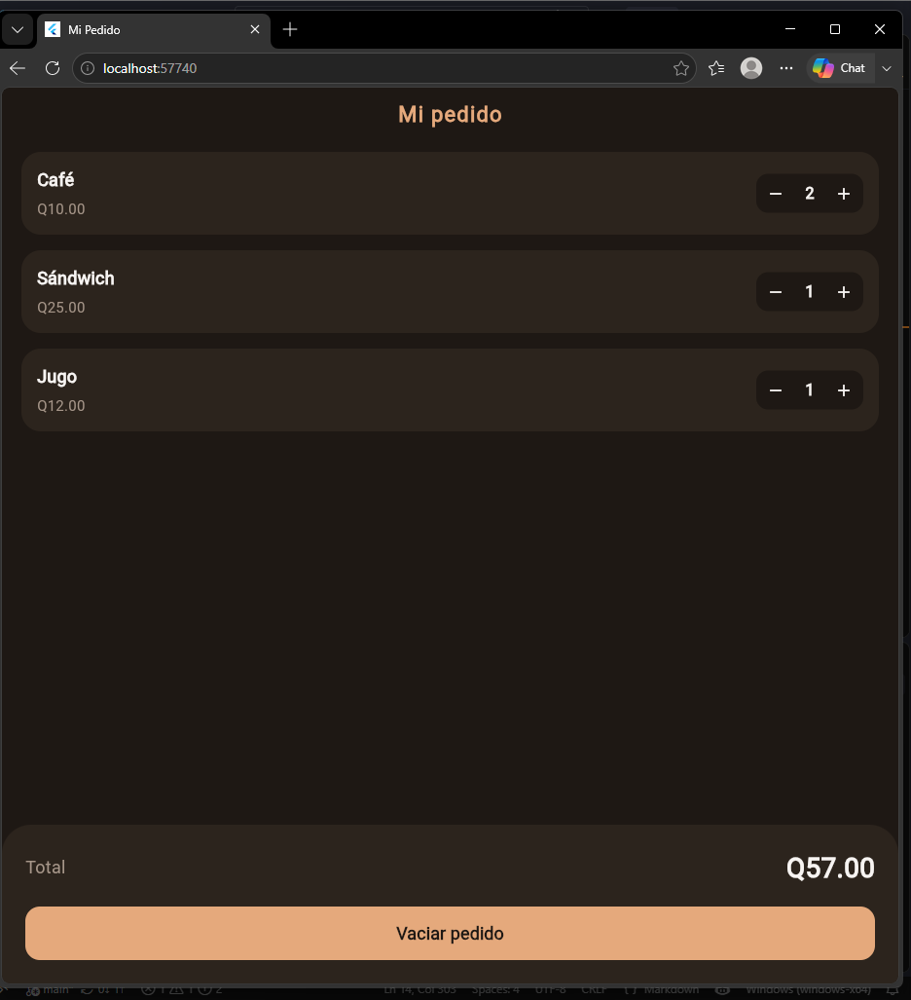

# Laboratorio Mi Pedido de Cafetería

## Captura de Validación
*(La siguiente captura demuestra el funcionamiento del estado local sumando 2 cafés, 1 sándwich y 1 jugo para un total de Q57.00)*

## Preguntas de Comprensión

**¿Cómo calcula el total?**
El total se calcula mediante un método o variable getter que multiplica la variable de cantidad de cada producto por su precio unitario, y luego suma estos tres resultados `(cantCafe * 10) + (cantSandwich * 25) + (cantJugo * 12)`. Ya que esta operación se encuentra dentro del ciclo de vida de la pantalla principal, cada vez que se presiona un botón y se dispara `setState`, la interfaz se redibuja recalculando automáticamente el monto final. 

**¿Por qué conviene reutilizar ProductoPedido?**
Conviene porque evita la duplicación de código, simplificando el árbol de widgets. En lugar de escribir el contenedor, los textos y los estilos tres veces, se define un solo molde visual (`ProductoPedido`) que recibe parámetros diferentes (nombre, precio, cantidad y funciones de los botones). Esto permite que si en el futuro se desea cambiar el color de las filas o agregar un nuevo producto, solo se deba modificar un bloque de código y el cambio se aplicará a toda la interfaz.