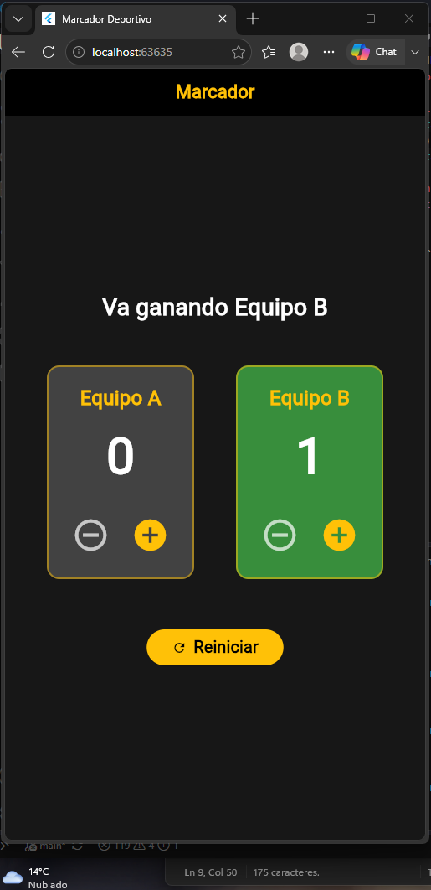
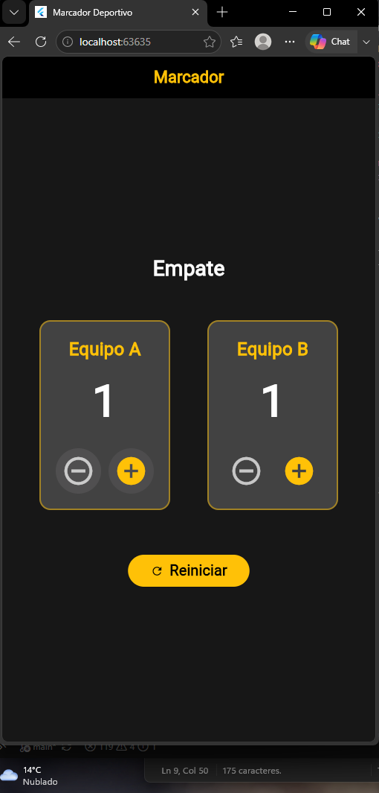

# Laboratorio: Marcador Deportivo

## Evidencia Fotográfica

## Pregunta de Comprensión
**¿Qué hace setState cuando presiona un botón y qué ocurriría si cambia los puntos sin llamarlo?**

La función `setState` le notifica al framework de Flutter que el estado interno del objeto ha cambiado de una manera que afecta a la interfaz de usuario. Al llamarlo, Flutter sabe que debe volver a ejecutar el método `build` para repintar la pantalla con los nuevos valores. 

Si modificamos la variable de los puntos (por ejemplo, `puntosEquipoA++`) sin envolverlo en un `setState`, el valor de la variable sí se actualizará correctamente en la memoria del dispositivo, pero la interfaz de la aplicación no sufrirá ningún cambio. La pantalla se quedará congelada mostrando los puntos anteriores porque Flutter no recibió el aviso de que debía actualizarse.